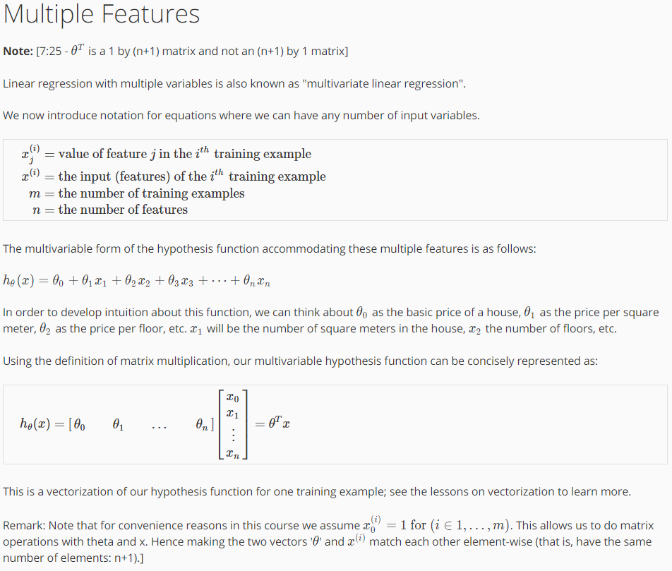

# 1. Introduction

### what is machine learning

machine learning definition

* arthur samuel(1959) - machine learning: Field of study that gives computers the ability to learn without being explicitly programmed.

recent definition

* tom michell(1998) - Well-posed learning problem: A computer program is said to learn from experience E with respect to some task T and some performance measure P, if its performance on T, as measured by P, improves with experience E.  
experience E : 학습 데이터
task T : 수행하는 행동
performance measure P : 제대로 수행할 확률

다양한 machine learning algorithms 이 있다.
크게 2가지로 나눌 수 있다.
    -	supervised learning
    -	unsupervised learning
others – reinforcement learning, recommender systems.
also talk about: practical advice for applying learning algorithms.

##### supervised learning - computer에게 "right answer"를 제공
In supervised learning, we are given a data set and already know what our correct output should look like, having the idea that there is a relationship between the input and the output.

Supervised learning problems are categorized into "regression" and "classification" problems. In a regression problem, we are trying to predict results within a continuous output, meaning that we are trying to map input variables to some continuous function. In a classification problem, we are instead trying to predict results in a discrete output. In other words, we are trying to map input variables into discrete categories.
>examples

1 classfication problem - discrete valued output(0 or 1)

2 regression problem : our goal is to predict a continuous valued output.
support vector machine - neat mathematical trick. 컴퓨터가 infinite한 features 들을 다룰 수 있게 도움.

##### unsupervised learning
Unsupervised learning allows us to approach problems with little or no idea what our results should look like. We can derive structure from data where we don't necessarily know the effect of the variables.

We can derive this structure by clustering the data based on relationships among the variables in the data.

With unsupervised learning there is no feedback based on the prediction results.
>examples

- Clustering: Take a collection of 1,000,000 different genes, and find a way to automatically group these genes into groups that are somehow similar or related by different variables, such as lifespan, location, roles, and so on.

- Non-clustering: The "Cocktail Party Algorithm", allows you to find structure in a chaotic environment. (i.e. identifying individual voices and music from a mesh of sounds at a cocktail party).

#2. Linear Regression with One Vairable( = univariate linear regression)
>notation
>m = Number of training examples
>x's = "input" variable/features
>y's = "output" variable/"target" variable
>(x, y) -> single row of training example
>(x(i), y(i)) -> ith row of training example

##### model representation

##### cost function

##### cost function intuition_1
hθ(x) = θ0 + θ1*x
인 원래의 hypothesis를 간단하게 나타내기 위해 θ0 = 0인 경우를 살펴본다.

##### const function intuition_2
θ0가 0이 아닌 경우 parameter가 2개이므로 3차원으로 나타나게 된다.
*contour plot (= contour feature)

A contour plot is a graphical technique for representing a 3-dimensional surface by plotting constant z slices, called contours, on a 2-dimensional format. That is, given a value for z, lines are drawn for connecting the (x,y) coordinates where that z value occurs.

#3. Parameter learning
##### gradient descent

##### gradient descent intuition

##### gradient descent for linear regression

#4. Multivariate Linear Regression

##### Multiple Features

##### gradient descent for multiple variables

##### gradient_descent_in_practice_1_feature_scaling

feature scaling에서 목표는 -1<= x <= 1이지만
-3 <= <= 3, -1/3 <= <=1/3 까지는 허용. 이거보다 작거나 크면 feature scaling이 필요.

##### gradient_descent_in_practice_2_learning_rate

gradient descent가 제대로 되고 있는지 확인하기 위해 "debugging"을 해야 한다. 그리고 이를 통해 learning rate α를 선택할 수 있다.
debugging은 gradient descent를 몇 번 iteration을 하는 지를 x-axis로, iteration 후의 θ에 따른 cost function j(θ)을 y-axis로 하는 그래프를 plot하여 할 수 있다. 이 경우 그래프를 통해 제대로 gradient descent가 이뤄지고 있는지 확인이 가능하다. 제대로 되었다면 convergence가 이루어짐을 확인할 수 있다.
또한, automatic convergence test를 통하여 한 번에 iteration 시 10^(-3)과 같은 작은 thresshold를 지정하여 convergence를 체크할 수 있지만 어떤 값을 선택해야 할 지 어렵다. (그냥 plot 해라)

learning rate은 너무 클 경우 대부분 convergence가 이뤄지지 않고 오히려 증가한다. (이뤄질 경우도 있지만 느리게 local minima가 됨)
또한, 너무 작을 경우 지나치게 느리게 convergence가 이뤄진다.
대부분의 경우 debugging을 위해 plot을 그려보고 제대로 gradient descent가 이뤄지지 않는다면 smaller alpha(learning rate)을 이용하면 해결된다.(수학적으로 증명: learning rate이 충분히 작다면 j(θ)는 every iteration마다 decrease한다.)

plot을 한 그림에서 flatten한 부분이 있다면 그곳이 convergence 지점.

대강 learning rate의 범위를 정하고 각각 plot하여 가장 급격하게 decrease하는 모양을 가진 것을 택해라

α = 
...., 0.0001, 0.0003, 0.001, 0.03, 0.1, .., 1, ....
등등 보통 *3배를 해가면서 체크
이 범위로 debugging을 하는 것이 일반적
##### Features and Polynomial Regression

cf) width, height 변수가 2가지라면 area = width * height로 변수를 모델에 맞게 편하게 설정할 수 있다는 아이디어를 염두에 두자.
일차함수 뿐만 아니라 다차함수에도 적용이 가능하다. 
우리의 데이터에 맞는 hypothesis function이 linear하지 않을 수 있다.
그렇기에 quadratic(2차 함수), cubic(3차 함수), square root(root 함수) 등등의 polynomial한 함수가 필요하다.
이 경우 feature scaling이 더욱 중요하다.

#5. Computing Parameters Analytically
##### Normal Equation

gradient descent의 alternative method. gradient descent가 iterative한 방식으로 문제를 해결한다면 normal equation은 분석적으로 문제를 해결한다. cost function j(θ)를 각각 partial derivative(편미분)한 식을 0으로 만든다면 기울기가 0이므로 최소값임을 알 수 있다.
그 때의 각각의 θj가 최소값으로 되는 θ가 된다.
gradient descent와 normal equation의 선택은 각각 장단이 있다.
normal equation은 iterative하지 않아도 되고, 따라서 learning rate를  필요로 하지 않는다. 때문에 gradient descent보다 빠르게 local minimum을 찾을 수 있다. 하지만 단점으로는 n by n matrix의 invert를 구할 수 있어야 하는데, 이는 O(N^3)의 시간복잡도를 필요로 한다. n이 커질 경우(feature의 갯수) computation시간이 오래 걸릴 수 있다.
andrew ng 교수님의 말에 의하면 대략적으로 10000부터 고민을 해야 한다고 한다. modern computer에서 100 x 100, 1000 x 1000은 금새 끝나고 10000부터는 고민이 필요하고 그 이상으로는 gradient descent가 유리하다.
또한, 더욱 복잡한 알고리즘인 classification, logistic regression alogirhtm들은 normal equation 적용이 불가능하고 gradient descent 알고리즘으로 해결한다.
수업에서 나온 수식에 대한 증명은 [수식증명](http://kgwcredit.tistory.com/13)에 있다.
http://kgwcredit.tistory.com/13
##### Normal Equation Noninvertibility

X^T*X가 non-invertible일 때가 있다.

하지만 이런 경우는 매우 드물기 때문에 걱정하지 않아도 된다.

만약  non-invertible 하다면,

feature 간에 연관성이 존재한다는 것이다. 즉 어떠한 feature들이 dependant하다.
혹은 feature의 수가 데이터에 비해 너무 많을 경우이다.

#6. Classification and Representation
##### classification

classfication 문제에서 linear regression을 적용해보는 것을 생각할 수 있다. 어떤 dataset에서는 hypothesis가 잘 맞아 떨어질 수도 있다.(threshold를 적용해서 0.5 정도에 맞춰서 나누기) 하지만 대부분의 경우, 어떤 특이한 사례에 맞춰 hypothesis가 전혀 다르게 그려질 수 있다. 또한, output y는 classification에서는 0 <=  <= 1이지만, linear regression을 적용할 때, y가 <0 또는 > 1이 될 수 있다.
따라서 우리는 classification 문제에서 logistic regression algorithm을 적용하여 해결할 것이다.

##### Hypothesis Representation

logistic regression에서의 hypothesis h(x)는 theta.T @ x를 함수 g의 parameter로 넘기는 것이다. 즉, h(x) = g(theta.T @ x)이다.
함수 g는 보통 sigmoid function ( = logistic function)을 사용한다.
sigmoid function = 1 / (1 + e^(-z))의 값을 취하고 이는 0<= <= 1 사이에 값이 존재한다.
classification problem에서 hypothesis의 의미는 y= 1(또는 다른 labeld value)이 나올 확률이다.
h(x) = P(y=1|x; theta) = 1 - P(y=0|x; theta)
-> probability (y = 1) given x, parameterized theta

##### Decision Boundary

y= 1을 판단하기 위해서는 h(x)는 >= 0.5
y= 0을 판단하기 위해서는 h(x)는 <  0.5이다.
h(x) = g(z)이고 z는 theta.T @ x이다.
함수 g는 sigmoid function이므로, theta.T @ x 가 0 <= 일 경우 h(x)가 >= 0.5가 되고, ( =  y = 1)
theta.T @ x 가 0 < 일 경우, h(x) 는 < 0.5가 된다. ( y = 0)

decision boundary는 y= 0과 y=1이 되는 area를 나누는 line을 의미한다. 그리고 decisioni boundary는 dataset이 아닌, hypothesis function에 의해 결정된다. (dataset은 hypothesis의 parameter를 결정하는 역할)
decision boundary는 반드시 linear할 필요 없다.

##### cost function(logistic regression)

linear regression에서 사용했던 cost function은 logistic regression에서는 사용할 수 없다. 그 이유는 logistic regression에서 사용했던 h(x)는 linear하지 않기 때문에, sigmoid function을 사용하기 때문에 square, 즉 제곱을 하게 되면 nonconvex function이 되버린다. 따라서 gradient descent를 한다 하더라도 수많은 local minimum이 존재하기 때문에 global minimum이 되기 힘들다.
따라서 다른 cost function을 사용해야 한다.
y = 1일 경우 -> cost function = -log(h(x))
y = 0일 경우 -> cost function = -log(1 - h(x))
이 function들을 plot하면 그림과 같은 형태가 된다.
기존 log 함수를 -하여 상하대칭하고 h(x)가 0<= <=1의 범위를 갖는걸 생각하자
y=1일 경우 h(x)가 1일 경우 정확하게 맞기 때문에 cost는 0,
		  h(x)가 0일 경우 cost를 infinity로 줘서 learning algorithm에게 엄청난 penalty를 주는 식이다.
이러한 cost function은 우리에게 convex function임을 보장해준다.

